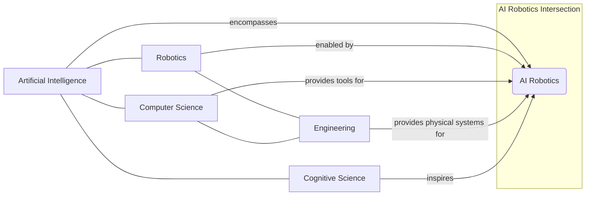

# Chapter 1: Introduction to AI and Robotics

## Learning Objectives

-   Understand the history of AI and robotics.
-   Define key terms in AI and robotics.
-   Recognize the main subfields within AI Robotics.

## Introduction

Welcome to the exciting world where artificial intelligence meets robotics! This chapter serves as your gateway into understanding the fundamental concepts that bridge these two transformative fields. We'll embark on a journey from the very origins of AI and robotics, exploring how these disciplines have evolved independently and, more importantly, how they've converged to create the intelligent machines that are rapidly reshaping our world. From industrial automation to sophisticated autonomous systems, the fusion of AI and robotics promises a future filled with unprecedented possibilities. Prepare to uncover the core definitions, historical milestones, and the diverse applications that make AI Robotics one of the most dynamic areas of modern technology.

## What is Artificial Intelligence (AI)?

Artificial Intelligence (AI) broadly refers to the simulation of human intelligence in machines that are programmed to think like humans and mimic their actions. The term encompasses a vast array of technologies and techniques aimed at enabling computers to perform tasks that typically require human cognition, such as learning, problem-solving, perception, and decision-making. At its core, AI strives to create systems capable of reasoning under uncertainty, adapting to new data, and improving their performance over time without explicit programming for every scenario.

The discipline of AI can be categorized into various types. Narrow AI (or Weak AI) is designed and trained for a particular task, like facial recognition or voice assistants. General AI (or Strong AI), on the other hand, would possess human-like cognitive abilities across a wide range of tasks. While General AI remains a long-term goal, the advancements in Narrow AI are continuously pushing the boundaries of what machines can achieve, impacting almost every sector from healthcare and finance to entertainment and, critically, robotics. Understanding AI is the first step towards comprehending how robots can move beyond mere automation to intelligent autonomy.

## What is a Robot?

A robot is a machine capable of carrying out a complex series of actions automatically, especially one programmable by a computer. Derived from the Czech word "robota," meaning forced labor, robots were initially envisioned as automatons designed to alleviate human toil. Modern robots, however, are far more sophisticated than their early counterparts. They are typically electromechanical devices that can interact with their environment, often possessing sensors to gather data and actuators to perform physical actions.

Key characteristics of a robot often include some degree of autonomy, the ability to sense and respond to their surroundings, and programmability. Robots come in various forms and sizes, from large industrial manipulators on assembly lines to miniature surgical robots and autonomous drones. Their physical capabilities allow them to perform tasks in environments that are dangerous, repetitive, or inaccessible to humans. When infused with AI, these machines transcend simple programmed movements to exhibit intelligent behaviors, adapting and making decisions in dynamic, unpredictable settings.

## The Intersection: AI Robotics

AI Robotics represents the powerful synergy between Artificial Intelligence and traditional robotics. It's the field dedicated to building intelligent robots—machines that can not only perform physical tasks but also comprehend, learn from, and adapt to their environments in a way that mimics human-like intelligence. This intersection moves beyond conventional automation, where robots follow predefined instructions, into a realm where robots can make autonomous decisions, perceive complex situations, and even engage in forms of reasoning and interaction.

The integration of AI enables robots to interpret sensory data (vision, touch, sound) with greater accuracy, navigate complex terrains, interact with humans more naturally, and learn new skills through experience or observation. For instance, an AI-powered robot can use computer vision to identify and sort objects, leverage machine learning to optimize its grip force, or employ natural language processing to understand verbal commands. This convergence is driving breakthroughs in areas like autonomous vehicles, collaborative robots (cobots), service robots, and exploration rovers, creating systems that are more versatile, efficient, and capable than ever before.

## A Brief History

The journey of AI and robotics is a rich tapestry woven with scientific breakthroughs, engineering marvels, and visionary ideas. The concept of artificial beings dates back to ancient myths, but the modern era of robotics began in the mid-20th century. The term "robot" was popularized by Karel Čapek's 1920 play *R.U.R.* The first industrial robot, Unimate, appeared in 1961, revolutionizing manufacturing.

Concurrently, the field of Artificial Intelligence emerged from the Dartmouth Workshop in 1956, marking its official birth. Early AI research focused on symbolic reasoning and problem-solving. While initial progress was rapid, both fields experienced "AI winters" and periods of slow development. The late 20th and early 21st centuries saw a resurgence, fueled by increased computational power, vast datasets, and algorithmic innovations, particularly in machine learning and deep learning. This era allowed AI to infuse robotics with the intelligence needed for truly autonomous and adaptive behavior, bridging the historical gap between the two disciplines and leading to the sophisticated AI robots we see today.

## Subfields of AI Robotics

The field of AI Robotics is incredibly interdisciplinary, drawing from computer science, engineering, cognitive science, and more. It encompasses several key subfields, each contributing to the development of intelligent machines:

1.  **Robotic Perception:** Focuses on enabling robots to sense and interpret their environment. This heavily involves computer vision (for cameras), sensor fusion (combining data from various sensors like LiDAR, radar, touch), and signal processing.
2.  **Robot Cognition & AI Planning:** Deals with how robots reason, make decisions, and plan sequences of actions to achieve goals. This includes areas like automated planning, knowledge representation, and machine learning for decision-making.
3.  **Robot Control & Motion Planning:** Concentrates on the physical movement and manipulation capabilities of robots. This involves kinematics (the study of motion without considering forces), dynamics (the study of forces that cause motion), and algorithms for generating smooth, collision-free paths.
4.  **Human-Robot Interaction (HRI):** Explores how humans and robots can effectively and safely work together. This subfield involves natural language processing (NLP) for verbal communication, gesture recognition, and understanding human intent and emotion.
5.  **Learning Robotics:** Focuses on enabling robots to learn new skills and adapt their behavior through experience, often using machine learning techniques like reinforcement learning or imitation learning. This allows robots to improve their performance over time and operate in novel situations.

These subfields are often intertwined, contributing synergistically to create the next generation of intelligent, autonomous robotic systems.

## Code Examples

### Example 1: Hello, AI Robotics!

This simple Python script introduces a basic interaction with a conceptual AI Robotics environment.

```python
# hello_ai_robotics.py

def greet_robotics_world():
    """Prints a greeting to the AI Robotics world."""
    print("Hello, AI Robotics!")

if __name__ == "__main__":
    greet_robotics_world()
```

### Example 2: Simple 2D Robot Movement Simulation

This example simulates a robot moving in a 2D plane based on simple commands. It's a foundational concept for understanding robot kinematics and motion planning.

```python
# simple_robot_2d.py
import math

class Robot:
    def __init__(self, x=0.0, y=0.0, orientation=0.0):
        """
        Initializes the robot's position and orientation.
        orientation is in degrees, 0 being along the positive x-axis.
        """
        self.x = x
        self.y = y
        self.orientation = orientation # degrees

    def move_forward(self, distance):
        """Moves the robot forward by a given distance."""
        self.x += distance * math.cos(math.radians(self.orientation))
        self.y += distance * math.sin(math.radians(self.orientation))
        print(f"Moved forward by {distance}. New position: ({self.x:.2f}, {self.y:.2f})")

    def turn(self, angle_degrees):
        """Changes the robot's orientation by a given angle."""
        self.orientation = (self.orientation + angle_degrees) % 360
        print(f"Turned by {angle_degrees} degrees. New orientation: {self.orientation:.2f} degrees")

    def get_position(self):
        """Returns the current position of the robot."""
        return self.x, self.y

    def get_orientation(self):
        """Returns the current orientation of the robot."""
        return self.orientation

if __name__ == "__main__":
    my_robot = Robot()
    print(f"Initial position: {my_robot.get_position()}, Orientation: {my_robot.get_orientation()}")

    my_robot.move_forward(10)
    my_robot.turn(90)
    my_robot.move_forward(5)
    my_robot.turn(-45)
    my_robot.move_forward(7)

    print(f"Final position: {my_robot.get_position()}, Final Orientation: {my_robot.get_orientation()}")


## Diagrams

### Figure 1.1: Overlap of AI, Robotics, and Related Fields



_This Venn diagram illustrates the interdisciplinary nature of AI Robotics, showing its core components and related fields._

```

