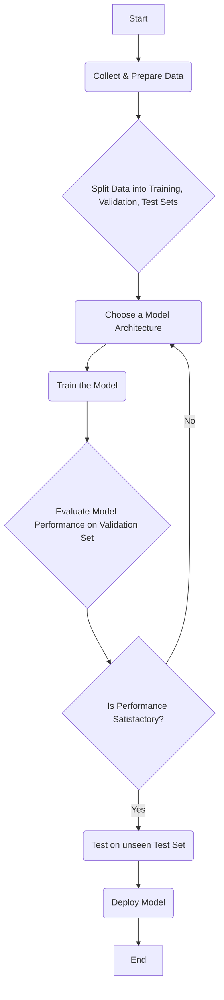

# Chapter 2: Foundations of Machine Learning for Robotics

## Learning Objectives

-   Grasp the concepts of supervised, unsupervised, and reinforcement learning.
-   Understand how Machine Learning (ML) is applied in robotics.
-   Identify key ML algorithms relevant to robotic tasks.

## Introduction

Machine Learning (ML) stands as a cornerstone of modern Artificial Intelligence, providing systems with the ability to learn from data without being explicitly programmed. In the realm of robotics, ML is the engine that transforms rigid, pre-programmed machines into adaptive, intelligent agents capable of operating in complex and unpredictable environments. This chapter delves into the fundamental concepts of machine learning, focusing specifically on how these powerful techniques are harnessed to enhance robotic capabilities. We will explore the three primary paradigms of ML—supervised, unsupervised, and reinforcement learning—and illustrate their distinct roles in various robotic applications, from perception and manipulation to navigation and decision-making. By understanding these foundational principles, you will gain insight into how robots acquire skills, recognize patterns, and continuously improve their performance, paving the way for truly autonomous systems.

## Supervised Learning (Classification/Regression)

Supervised learning is the most common paradigm in machine learning, characterized by its reliance on labeled datasets. In this approach, an algorithm learns to map input data to an output label based on example input-output pairs. The "supervision" comes from the fact that the correct output for each input is known. Supervised learning tasks are typically divided into two categories:

1.  **Classification:** Used when the output variable is a category. For instance, a robot might use a supervised classification model to identify objects in its environment (e.g., "cup," "book," "person") based on camera input. Another example is detecting anomalies or defects in manufactured parts.
2.  **Regression:** Used when the output variable is a real value. A robot could employ a regression model to predict the optimal force to apply when grasping an object of a certain weight and material, or to estimate the distance to an obstacle based on sensor readings.

In robotics, supervised learning is extensively used for tasks such as:
*   **Object Recognition:** Training a robot to identify different objects it might encounter.
*   **Speech Recognition:** Allowing robots to understand verbal commands.
*   **Predictive Maintenance:** Forecasting when a robotic component might fail.
*   **Localization:** Using known landmarks to determine a robot's position.

The success of supervised learning models heavily depends on the quality and quantity of the labeled data. Data annotation can be a time-consuming and expensive process, especially for complex robotic scenarios.

## Unsupervised Learning (Clustering)

In contrast to supervised learning, unsupervised learning deals with unlabeled data. The goal of unsupervised learning is to discover hidden patterns, structures, or relationships within the input data without any prior knowledge of the output. This is particularly useful in exploratory data analysis and scenarios where labeling data is impractical or impossible.

One of the most prominent techniques in unsupervised learning is **clustering**. Clustering algorithms group similar data points together into clusters. In robotics, unsupervised learning can be applied to:
*   **Environmental Mapping:** Grouping similar sensor readings to identify distinct areas or features in an unknown environment.
*   **Anomaly Detection:** Identifying unusual patterns in sensor data that might indicate a malfunction or an unexpected event.
*   **Behavioral Analysis:** Discovering recurring patterns in robot interactions or human-robot collaboration.
*   **Dimensionality Reduction:** Simplifying complex sensor data while preserving essential information, which can make subsequent supervised learning tasks more efficient.

Unsupervised learning empowers robots to make sense of novel situations and adapt to new environments without requiring human intervention for labeling every piece of information.

## Reinforcement Learning (Q-Learning, Policy Gradients)

Reinforcement Learning (RL) is a paradigm inspired by behavioral psychology, where an agent learns to make decisions by performing actions in an environment and receiving rewards or penalties. The agent's goal is to maximize the cumulative reward over time. Unlike supervised learning, RL agents are not given explicit instructions or labeled data; instead, they learn through trial and error.

Key components of an RL system include:
*   **Agent:** The learner and decision-maker (the robot).
*   **Environment:** The physical or simulated world the agent interacts with.
*   **State:** The current situation of the agent in the environment.
*   **Action:** A move made by the agent.
*   **Reward:** Feedback from the environment indicating the desirability of an action.
*   **Policy:** A strategy that the agent uses to determine its next action based on the current state.

Two popular algorithms in RL are:
*   **Q-Learning:** A value-based RL algorithm that learns an action-value function (Q-function), which gives the expected utility of taking a given action in a given state.
*   **Policy Gradients:** A class of algorithms that directly learns a policy function, which maps states to actions without explicitly computing a value function.

In robotics, RL has shown remarkable success in tasks requiring autonomous decision-making and continuous adaptation, such as:
*   **Grasping and Manipulation:** Learning optimal ways to pick up and move objects.
*   **Locomotion:** Teaching robots to walk, run, or fly efficiently.
*   **Navigation:** Training robots to navigate complex environments and avoid obstacles.
*   **Human-Robot Interaction:** Learning to respond appropriately to human gestures or commands.

RL allows robots to acquire complex skills that would be difficult to program manually, making them highly adaptive.

## Datasets for Robotics

The availability of high-quality datasets is crucial for training effective ML models for robotics. Robotic datasets differ from general ML datasets in that they often combine various modalities (e.g., images, depth maps, sensor readings like LiDAR, IMU data, joint angles, force feedback) and come with temporal dependencies. Creating such datasets can be challenging due to the need for synchronized sensor readings and precise ground truth labeling.

Common types of robotic datasets include:
*   **Image and Video Datasets:** For object detection, recognition, and scene understanding (e.g., ImageNet, COCO, KITTI for autonomous driving).
*   **Point Cloud Datasets:** From LiDAR or depth cameras, for 3D perception and mapping.
*   **Time-Series Sensor Data:** From IMUs, encoders, force sensors, used for state estimation, anomaly detection, and control.
*   **Human Demonstrations:** For imitation learning, where robots learn by observing human experts.

Many public datasets are available, often collected from real-world robots or high-fidelity simulators. Researchers also frequently create custom datasets for specific tasks. Effective data management, preprocessing, and augmentation are vital steps in leveraging these datasets to build robust and intelligent robotic systems.

## Summary

This chapter laid the groundwork for understanding Machine Learning in the context of robotics. We explored the three main branches of ML: supervised learning, where models learn from labeled data to make predictions or classifications; unsupervised learning, which uncovers hidden patterns and structures in unlabeled data; and reinforcement learning, where an agent learns optimal behaviors through trial and error interactions with an environment. Each paradigm offers unique strengths that are directly applicable to robotic challenges, such as object recognition, anomaly detection, and autonomous control. By integrating these ML foundations, robots can move beyond programmed routines to exhibit adaptability, learn new skills, and make intelligent decisions, thereby advancing towards greater autonomy and efficiency in diverse real-world scenarios.

## Code Examples

### Example 1: Simple Linear Regression for Robot Arm Position Prediction

This Python code demonstrates a basic linear regression model to predict a robot arm's end-effector position based on a single joint angle. This is a simplified supervised learning example for regression.

```python
# simple_linear_regression_robot.py
import numpy as np
from sklearn.linear_model import LinearRegression
import matplotlib.pyplot as plt

# Simulate data: joint angle (input) vs. end-effector position (output)
# Let's assume a simple arm where position changes linearly with angle
joint_angles = np.array([10, 20, 30, 40, 50, 60, 70, 80]).reshape(-1, 1) # in degrees
end_effector_positions = np.array([0.1, 0.3, 0.5, 0.7, 0.9, 1.1, 1.3, 1.5]) # in meters

# Create and train the linear regression model
model = LinearRegression()
model.fit(joint_angles, end_effector_positions)

# Predict for new joint angles
new_angles = np.array([25, 55, 90]).reshape(-1, 1)
predicted_positions = model.predict(new_angles)

print("Joint Angles (degrees):", joint_angles.flatten())
print("End-Effector Positions (meters):", end_effector_positions)
print("\nNew Angles for Prediction:", new_angles.flatten())
print("Predicted End-Effector Positions:", predicted_positions)

# Optional: Plotting for visualization
# plt.scatter(joint_angles, end_effector_positions, color='blue', label='Actual Data')
# plt.plot(joint_angles, model.predict(joint_angles), color='red', label='Regression Line')
# plt.scatter(new_angles, predicted_positions, color='green', marker='x', s=100, label='Predictions')
# plt.xlabel("Joint Angle (degrees)")
# plt.ylabel("End-Effector Position (meters)")
# plt.title("Linear Regression for Robot Arm Position")
# plt.legend()
# plt.grid(True)
# plt.show()
```

### Example 2: K-Means Clustering for Object Sorting (Simulated)

This Python code simulates object sorting using K-Means clustering, an unsupervised learning technique. A robot might use this to group objects with similar features without prior labeling.

```python
# k_means_object_sorting.py
from sklearn.cluster import KMeans
import numpy as np
# import matplotlib.pyplot as plt

# Simulate object features (e.g., [weight, color_intensity])
# Let's say we have 3 types of objects we want to sort
X = np.array([
    [1.0, 0.1], [1.1, 0.2], [0.9, 0.15], # Group 1 (small, light color)
    [2.5, 0.8], [2.7, 0.9], [2.4, 0.75], # Group 2 (medium, medium color)
    [5.0, 0.4], [5.2, 0.35], [4.8, 0.45]  # Group 3 (large, dark color)
])

# Define the number of clusters (types of objects to sort into)
n_clusters = 3

# Apply K-Means clustering
kmeans = KMeans(n_clusters=n_clusters, random_state=0, n_init=10)
kmeans.fit(X)

# Get cluster labels for each object
labels = kmeans.labels_

# Get the centroids of the clusters
centroids = kmeans.cluster_centers_

print("Object Features:\n", X)
print("\nCluster Labels for Objects:", labels)
print("\nCluster Centroids (simulated object types):\n", centroids)

# Optional: Plotting for visualization
# plt.scatter(X[:, 0], X[:, 1], c=labels, cmap='viridis', s=50, alpha=0.8)
# plt.scatter(centroids[:, 0], centroids[:, 1], c='red', marker='X', s=200, label='Centroids')
# plt.xlabel("Feature 1 (e.g., Weight)")
# plt.ylabel("Feature 2 (e.g., Color Intensity)")
# plt.title("K-Means Clustering for Object Sorting")
# plt.legend()
# plt.grid(True)
# plt.show()
```

## Diagrams

### Figure 2.1: Flowchart of a Typical Machine Learning Model Training Process



_This flowchart illustrates the iterative process of developing and refining a machine learning model, from data preparation to deployment._