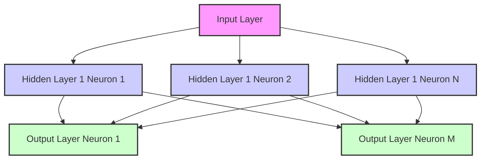

# Chapter 3: Deep Learning and Neural Networks

## Learning Objectives

-   Understand the fundamental architecture of neural networks.
-   Grasp the concepts of Convolutional Neural Networks (CNNs) and Recurrent Neural Networks (RNNs).
-   Recognize the role of deep learning in modern AI and robotics applications.

## Introduction

Deep Learning, a powerful subfield of Machine Learning, has revolutionized Artificial Intelligence by enabling systems to learn complex patterns directly from raw data. At its heart lies the artificial neural network, a computational model inspired by the structure and function of the human brain. This chapter will take you on a journey into the fascinating world of deep learning, demystifying the intricate architectures that power today's most advanced AI systems. We will explore the building blocks of neural networks, delve into specialized forms like Convolutional Neural Networks (CNNs) crucial for visual perception in robotics, and examine Recurrent Neural Networks (RNNs) essential for processing sequential data. By the end of this chapter, you will have a solid understanding of how deep learning empowers robots to perceive, understand, and interact with their environment with unprecedented accuracy and adaptability.

## The Artificial Neuron

The artificial neuron, often called a perceptron, is the fundamental building block of a neural network. Inspired by biological neurons, it receives one or more inputs, applies a transformation to them, and produces an output. Each input is associated with a "weight," which represents the strength of that connection. The neuron sums these weighted inputs, adds a bias term, and then passes the result through an activation function. The activation function introduces non-linearity, enabling the network to learn complex, non-linear relationships in data.

Mathematically, a single neuron's operation can be described as:
`output = activation_function( (input1 * weight1) + (input2 * weight2) + ... + bias )`

Common activation functions include:
*   **Sigmoid:** Squashes values between 0 and 1, useful for binary classification.
*   **ReLU (Rectified Linear Unit):** `f(x) = max(0, x)`, widely used for its computational efficiency and ability to mitigate vanishing gradient problems.
*   **Tanh (Hyperbolic Tangent):** Squashes values between -1 and 1.

The ability of these simple units to process information and learn from data, when stacked in layers and trained with vast amounts of data, forms the basis of deep learning's power.

## Multi-Layer Perceptrons (MLPs)

Multi-Layer Perceptrons (MLPs), also known as feedforward neural networks, are the simplest type of deep neural network. An MLP consists of an input layer, one or more hidden layers, and an output layer. Each layer is composed of multiple neurons, and every neuron in one layer is connected to every neuron in the next layer, with connections flowing in one direction—forward.

In an MLP:
*   **Input Layer:** Receives the raw data.
*   **Hidden Layers:** Perform intermediate computations, extracting features and patterns from the input. The "deep" aspect of deep learning refers to the presence of multiple hidden layers.
*   **Output Layer:** Produces the final result, such as a classification (e.g., probability of an object being a "car") or a regression value (e.g., predicted torque for a robot joint).

Training an MLP involves an algorithm called backpropagation, which calculates the gradient of the loss function with respect to the network's weights and biases, and then uses an optimization algorithm (like stochastic gradient descent) to adjust these parameters to minimize the loss. MLPs are versatile and can be used for a wide range of tasks, including basic pattern recognition, regression, and simple control policies in robotics.

## Convolutional Neural Networks (CNNs) for Vision

Convolutional Neural Networks (CNNs) are a specialized class of neural networks primarily designed for processing data with a grid-like topology, such as images. Their architecture is particularly well-suited for tasks like image recognition, object detection, and semantic segmentation, making them indispensable for robotic perception.

The key innovation in CNNs is the **convolutional layer**, which applies a learnable filter (or kernel) across the input data. This operation extracts local features, such as edges, textures, and patterns. These features are then combined to form higher-level, more abstract representations. Other common layers in CNNs include:
*   **Pooling Layers:** Reduce the spatial dimensions of the feature maps, helping to make the network more robust to small variations and reducing computational load.
*   **Fully Connected Layers:** Typically appear at the end of the network, performing high-level reasoning based on the features extracted by the convolutional and pooling layers.

In robotics, CNNs enable:
*   **Object Recognition and Tracking:** Allowing robots to identify and follow objects in their environment.
*   **Scene Understanding:** Helping autonomous vehicles understand road conditions and detect obstacles.
*   **Visual Servoing:** Guiding robot manipulators using visual feedback.

The ability of CNNs to automatically learn hierarchical features directly from raw image pixels has been a game-changer for equipping robots with sophisticated visual intelligence.

## Recurrent Neural Networks (RNNs) for Sequences

Recurrent Neural Networks (RNNs) are a class of neural networks designed to process sequential data, where the order of information matters. Unlike feedforward networks, RNNs have loops that allow information to persist from one step of the sequence to the next, giving them a "memory" of previous inputs. This makes them ideal for tasks involving time series, natural language, and sequential decision-making, all common in robotics.

The core idea behind an RNN is that each neuron's output is fed back into itself (or into other neurons in the same layer) at the next time step. This recurrent connection allows the network to maintain an internal state that captures information about the sequence processed so far. However, basic RNNs suffer from the vanishing gradient problem, making it difficult to learn long-term dependencies.

To address this, more advanced architectures like:
*   **Long Short-Term Memory (LSTM) networks:** Introduce "gates" (input, forget, output) that control the flow of information, enabling the network to remember or forget information over long periods.
*   **Gated Recurrent Units (GRUs):** A simpler variant of LSTMs with fewer gates but similar effectiveness.

In robotics, RNNs (especially LSTMs and GRUs) are used for:
*   **Robot Trajectory Prediction:** Forecasting the future path of moving objects or other robots.
*   **Speech Command Recognition:** Understanding sequences of spoken words.
*   **Learning from Demonstrations:** Processing sequences of human movements to imitate tasks.
*   **Force Control:** Adapting robot forces based on a sequence of tactile sensor readings.

RNNs, particularly their gated variants, provide robots with the capability to understand and react to dynamic, time-dependent information, which is fundamental for nuanced interaction and adaptive control.

## Summary

This chapter provided a comprehensive introduction to Deep Learning and Neural Networks, fundamental components of modern AI Robotics. We explored the basic structure of an artificial neuron and how these units connect to form multi-layered networks capable of learning hierarchical representations of data. We then delved into two critical types of neural networks: Convolutional Neural Networks (CNNs), which are exceptionally powerful for image and spatial data processing, making them indispensable for robotic vision and perception; and Recurrent Neural Networks (RNNs), designed to handle sequential data like time series or natural language, crucial for understanding temporal patterns in robotic control and human-robot interaction. The chapter emphasized how deep learning's ability to automatically extract features from large datasets has propelled advancements in AI, providing robots with enhanced capabilities for learning, adaptation, and autonomous operation.

## Code Examples

### Example 1: Building a Simple Multi-Layer Perceptron (MLP) with TensorFlow/Keras

This example demonstrates how to build and train a basic MLP for a binary classification task. While simplified, it illustrates the core concepts of input, hidden, and output layers, activation functions, and training with backpropagation.

```python
# simple_mlp.py
import tensorflow as tf
from tensorflow.keras import layers, models
import numpy as np

# 1. Generate synthetic data for binary classification
# X: 2 features (e.g., robot sensor readings)
# y: 0 or 1 (e.g., "safe" or "unsafe" state)
X = np.array([
    [0, 0], [0, 1], [1, 0], [1, 1],
    [0.1, 0.1], [0.9, 0.9], [0.1, 0.9], [0.9, 0.1]
], dtype=np.float32)
y = np.array([0, 1, 1, 0, 0, 0, 1, 1], dtype=np.float32) # XOR-like problem

# 2. Define the MLP model
model = models.Sequential([
    layers.Dense(4, activation='relu', input_shape=(2,)), # Hidden layer with 4 neurons
    layers.Dense(1, activation='sigmoid')                  # Output layer for binary classification
])

# 3. Compile the model
model.compile(optimizer='adam',
              loss='binary_crossentropy',
              metrics=['accuracy'])

# 4. Train the model
print("Training the MLP model...")
model.fit(X, y, epochs=100, verbose=0) # verbose=0 to suppress output during training

# 5. Evaluate the model
loss, accuracy = model.evaluate(X, y, verbose=0)
print(f"MLP Model Accuracy: {accuracy*100:.2f}%")

# 6. Make predictions
predictions = (model.predict(X) > 0.5).astype(int)
print("\nPredictions:")
for i in range(len(X)):
    print(f"Input: {X[i]}, Actual: {y[i]}, Predicted: {predictions[i][0]}")
```

### Example 2: Basic Convolutional Neural Network (CNN) for Image Classification

This example demonstrates a rudimentary CNN built with TensorFlow/Keras to classify simple images (e.g., from the MNIST dataset for digit recognition). This highlights the core components of a CNN suitable for robotic vision tasks.

```python
# basic_cnn.py
import tensorflow as tf
from tensorflow.keras import layers, models
from tensorflow.keras.datasets import mnist
# import matplotlib.pyplot as plt # Uncomment for visualization

# 1. Load and preprocess the MNIST dataset
(train_images, train_labels), (test_images, test_labels) = mnist.load_data()

# Reshape images to (batch, height, width, channels) and normalize pixel values
train_images = train_images.reshape((60000, 28, 28, 1)).astype('float32') / 255
test_images = test_images.reshape((10000, 28, 28, 1)).astype('float32') / 255

# 2. Define the CNN model
model = models.Sequential([
    layers.Conv2D(32, (3, 3), activation='relu', input_shape=(28, 28, 1)),
    layers.MaxPooling2D((2, 2)),
    layers.Conv2D(64, (3, 3), activation='relu'),
    layers.MaxPooling2D((2, 2)),
    layers.Conv2D(64, (3, 3), activation='relu'), # Another convolutional layer
    layers.Flatten(),                              # Flatten for dense layers
    layers.Dense(64, activation='relu'),           # Hidden dense layer
    layers.Dense(10, activation='softmax')         # Output layer for 10 digits
])

# 3. Compile the model
model.compile(optimizer='adam',
              loss='sparse_categorical_crossentropy',
              metrics=['accuracy'])

# 4. Train the model
print("Training the CNN model...")
model.fit(train_images, train_labels, epochs=5, verbose=0)

# 5. Evaluate the model
test_loss, test_acc = model.evaluate(test_images, test_labels, verbose=0)
print(f"\nCNN Model Test Accuracy: {test_acc*100:.2f}%")

# Optional: Visualize a prediction
# predictions = model.predict(test_images)
# plt.imshow(test_images[0].reshape(28, 28), cmap='gray')
# plt.title(f"Predicted: {np.argmax(predictions[0])}, Actual: {test_labels[0]}")
# plt.show()
```

## Diagrams

### Figure 3.1: Architecture of a Simple Feedforward Neural Network



_This diagram illustrates a basic feedforward neural network with an input layer, a single hidden layer, and an output layer. Each arrow represents a weighted connection between neurons._