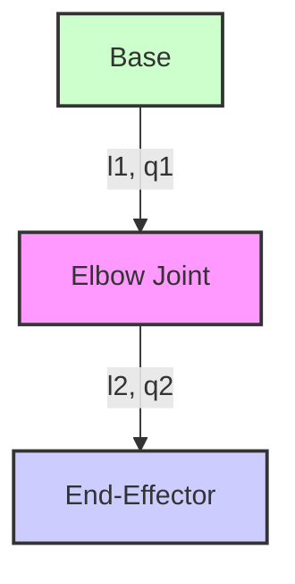

# Chapter 6: Kinematics and Motion

## Learning Objectives

-   Understand the fundamental concepts of robot kinematics.
-   Differentiate between forward and inverse kinematics problems.
-   Grasp the significance of the Jacobian matrix in robot motion analysis.

## Introduction

At the heart of any robotic system lies its ability to move and interact with the physical world. This capability is governed by a fundamental branch of robotics known as kinematics, which is the study of motion without considering the forces that cause it. Understanding kinematics is crucial for designing, controlling, and programming robots, enabling them to reach specific points in space, avoid obstacles, and perform complex tasks with precision. This chapter will delve into the mathematical framework that describes robot motion, introducing concepts such as degrees of freedom, forward kinematics (determining the end-effector's position given joint angles), and inverse kinematics (calculating joint angles needed to reach a desired end-effector position). We will also explore the critical role of the Jacobian matrix, a powerful tool for analyzing robot velocities and forces. By mastering these principles, you will gain the foundational knowledge necessary to command a robot's movements effectively and intuitively.

## Degrees of Freedom (DOF)

Degrees of Freedom (DOF) refer to the number of independent parameters that define the configuration or state of a mechanical system. In robotics, it typically refers to the number of independent movements a robot can perform. For instance, a rigid body in 3D space has 6 DOFs: 3 for translational movement (along X, Y, Z axes) and 3 for rotational movement (around X, Y, Z axes, often called roll, pitch, and yaw).

The number of DOFs in a robot manipulator is usually determined by the number of its actuated joints. Each joint (e.g., revolute or prismatic) adds one DOF.
*   **Revolute Joint:** Allows rotational motion around an axis (like a hinge).
*   **Prismatic Joint:** Allows linear sliding motion along an axis.

The concept of DOF is critical because it dictates a robot's dexterity and its ability to reach various positions and orientations in its workspace.
*   **Redundant Robots:** Robots with more DOFs than necessary to achieve a specific task (e.g., 7-DOF arm for a 6-DOF task). Redundancy provides flexibility, allowing the robot to avoid obstacles or optimize for other criteria (like energy consumption) while performing the task.
*   **Underactuated Robots:** Robots with fewer actuators than DOFs. These robots often rely on gravity or external forces for some of their movements, making their control more complex.

Understanding the DOFs of a robot is the first step in analyzing its kinematic behavior and designing effective control strategies.

## Forward Kinematics

Forward Kinematics (FK) is the process of determining the position and orientation (pose) of the robot's end-effector (e.g., gripper, tool) given the values of its joint variables (e.g., angles for revolute joints, displacements for prismatic joints). Essentially, you know how each joint is configured, and you want to calculate where the tip of the robot is in space.

FK is generally a straightforward process. It involves a series of transformations from one joint frame to the next, starting from the robot's base frame and moving towards the end-effector. Each transformation accounts for the geometry of the link and the state of the joint connecting it to the previous link.

The most common method for solving FK for serial chain manipulators is using **Denavit-Hartenberg (D-H) parameters**. The D-H convention provides a standardized way to assign coordinate frames to each link in a robot arm and derive transformation matrices between these frames. By multiplying these transformation matrices, one can obtain the final transformation from the base to the end-effector, thereby determining its pose.

FK is fundamental for:
*   **Visualization:** Displaying the robot's current configuration.
*   **Collision Detection:** Checking if the robot's links are colliding with objects in the environment.
*   **Path Planning:** Verifying that a planned sequence of joint movements results in a desired trajectory for the end-effector.

## Inverse Kinematics

Inverse Kinematics (IK) is arguably a more challenging problem than FK and is often more directly relevant to task-oriented robot programming. IK involves determining the values of the robot's joint variables (angles or displacements) required to achieve a desired pose (position and orientation) for its end-effector. Essentially, you know where you want the robot's hand to be, and you need to calculate how each joint should move to get it there.

Unlike FK, IK often has:
*   **Multiple Solutions:** A robot arm might be able to reach a single point in space in several different configurations (e.g., "elbow up" or "elbow down" for a human-like arm).
*   **No Solution:** The desired pose might be outside the robot's reachable workspace.
*   **Singularities:** Certain joint configurations where the robot loses one or more degrees of freedom, making it unable to move its end-effector in certain directions.

Methods for solving IK problems typically fall into two categories:
1.  **Analytical Solutions:** Provide a closed-form mathematical expression for the joint variables. These are exact, fast, and find all possible solutions. However, they are only feasible for simpler robot geometries (e.g., 3-DOF planar arms, 6-DOF industrial robots with specific joint alignments).
2.  **Numerical Solutions:** Involve iterative algorithms that approximate the solution. These are more general and can handle complex robot geometries but are slower, may get stuck in local minima, and require an initial guess. Common numerical methods include the Jacobian pseudo-inverse method.

IK is crucial for:
*   **Task Planning:** Translating desired end-effector motions into joint commands.
*   **Trajectory Generation:** Creating smooth, collision-free paths for the robot's end-effector.
*   **Human-Robot Collaboration:** Allowing humans to demonstrate a task by moving the end-effector, with the robot learning the corresponding joint movements.

## The Jacobian Matrix

The Jacobian matrix is a fundamental concept in robotics kinematics that bridges the relationship between joint-space velocities and end-effector-space velocities. It is a matrix of partial derivatives that transforms velocities from the joint space (how fast each joint is moving) to the task space (how fast and in what direction the end-effector is moving).

For a robot with `n` joints and an end-effector pose defined by `m` parameters (typically 6 for 3D position and 3D orientation), the Jacobian matrix `J` will be an `m x n` matrix.

Specifically, if `q` is the vector of joint variables and `x` is the vector representing the end-effector pose, then the relationship between their velocities is given by:
`ẋ = J(q) q̇`
where `ẋ` is the end-effector velocity, `q̇` is the joint velocity, and `J(q)` is the Jacobian matrix, which is a function of the current joint configuration `q`.

The Jacobian is vital for several aspects of robot control and analysis:
*   **Velocity Control:** Directly relates desired end-effector velocities to required joint velocities.
*   **Singularity Analysis:** Identifies joint configurations where the robot loses one or more DOFs. At singularities, the Jacobian matrix becomes rank-deficient (its determinant is zero), meaning that certain end-effector velocities cannot be achieved, or infinite joint velocities are required.
*   **Force Control:** Inversely, the Jacobian relates forces/torques in the joint space to forces/torques exerted by the end-effector in the task space.
*   **Inverse Kinematics (Numerical Solutions):** The pseudo-inverse of the Jacobian is often used in iterative numerical IK solvers to compute the required joint velocity changes from desired end-effector velocity changes.

Understanding the Jacobian is essential for advanced robot control, allowing for precise manipulation and interaction with the environment.

## Summary

This chapter provided a foundational understanding of robot kinematics and motion. We began by defining degrees of freedom and how they relate to a robot's mobility. The core concepts of forward kinematics, which maps joint variables to the end-effector's pose, and inverse kinematics, which solves the inverse problem of finding joint configurations for a desired end-effector pose, were thoroughly discussed. We highlighted that while forward kinematics typically has a unique solution, inverse kinematics can be more challenging, often yielding multiple solutions or no solution at all. Furthermore, the critical role of the Jacobian matrix was introduced as a tool for analyzing differential relationships between joint velocities and end-effector velocities. This mathematical framework is indispensable for tasks such as velocity control, singularity analysis, and understanding compliance in robotic systems. Grasping these kinematic principles is essential for anyone looking to design, simulate, or control robotic manipulators effectively.

## Code Examples

### Example 1: Forward Kinematics for a 2-DOF Planar Robot

This Python code calculates the end-effector position (x, y) of a simple 2-Degree-of-Freedom (2-DOF) planar robot arm given its joint angles and link lengths.

```python
# forward_kinematics_2dof.py
import math

def forward_kinematics_2dof(l1, l2, q1_degrees, q2_degrees):
    """
    Calculates the end-effector position (x, y) for a 2-DOF planar robot arm.

    Args:
        l1 (float): Length of the first link.
        l2 (float): Length of the second link.
        q1_degrees (float): Angle of the first joint in degrees (relative to x-axis).
        q2_degrees (float): Angle of the second joint in degrees (relative to first link).

    Returns:
        tuple: (x, y) coordinates of the end-effector.
    """
    q1_rad = math.radians(q1_degrees)
    q2_rad = math.radians(q2_degrees)

    # X-coordinate of end-effector
    x = l1 * math.cos(q1_rad) + l2 * math.cos(q1_rad + q2_rad)
    # Y-coordinate of end-effector
    y = l1 * math.sin(q1_rad) + l2 * math.sin(q1_rad + q2_rad)

    return x, y

if __name__ == "__main__":
    link_length_1 = 1.0  # meters
    link_length_2 = 0.8  # meters
    
    joint_angle_1 = 30   # degrees
    joint_angle_2 = 60   # degrees

    end_effector_x, end_effector_y = forward_kinematics_2dof(
        link_length_1, link_length_2, joint_angle_1, joint_angle_2
    )

    print(f"Robot arm with L1={link_length_1}m, L2={link_length_2}m")
    print(f"Joint angles: q1={joint_angle_1}°, q2={joint_angle_2}°")
    print(f"End-effector position: X={end_effector_x:.2f}m, Y={end_effector_y:.2f}m")

    # Example 2: Different configuration
    joint_angle_1 = 90
    joint_angle_2 = -45
    end_effector_x, end_effector_y = forward_kinematics_2dof(
        link_length_1, link_length_2, joint_angle_1, joint_angle_2
    )
    print(f"\nJoint angles: q1={joint_angle_1}°, q2={joint_angle_2}°")
    print(f"End-effector position: X={end_effector_x:.2f}m, Y={end_effector_y:.2f}m")
```

### Example 2: Analytical Inverse Kinematics for a 2-DOF Planar Robot

This Python code provides an analytical solution for the joint angles (q1, q2) of a 2-DOF planar robot arm, given the desired end-effector position (x, y) and link lengths. This demonstrates a common approach to Inverse Kinematics.

```python
# inverse_kinematics_2dof.py
import math

def inverse_kinematics_2dof(l1, l2, target_x, target_y):
    """
    Calculates the joint angles (q1, q2) for a 2-DOF planar robot arm
    given the target end-effector position (x, y) and link lengths.

    Args:
        l1 (float): Length of the first link.
        l2 (float): Length of the second link.
        target_x (float): Desired X-coordinate of the end-effector.
        target_y (float): Desired Y-coordinate of the end-effector.

    Returns:
        tuple: (q1_degrees, q2_degrees) joint angles in degrees, or None if unreachable.
    """
    # Calculate distance from origin to target
    d_squared = target_x**2 + target_y**2
    d = math.sqrt(d_squared)

    # Check if target is reachable
    if d > (l1 + l2) or d < abs(l1 - l2):
        print(f"Warning: Target ({target_x:.2f}, {target_y:.2f}) is unreachable.")
        return None

    # Calculate q2 (elbow angle) using Law of Cosines
    cos_q2 = (d_squared - l1**2 - l2**2) / (2 * l1 * l2)
    
    # Handle floating point inaccuracies that might push cos_q2 slightly outside [-1, 1]
    cos_q2 = max(-1.0, min(1.0, cos_q2))
    
    q2_rad_solution1 = math.acos(cos_q2)  # Elbow-up solution
    q2_rad_solution2 = -q2_rad_solution1 # Elbow-down solution

    # Calculate alpha (angle from x-axis to the line connecting origin and target)
    alpha = math.atan2(target_y, target_x)

    # Calculate beta (angle of the first link relative to the line from origin to target)
    beta_solution1 = math.atan2(l2 * math.sin(q2_rad_solution1), l1 + l2 * math.cos(q2_rad_solution1))
    beta_solution2 = math.atan2(l2 * math.sin(q2_rad_solution2), l1 + l2 * math.cos(q2_rad_solution2))

    # Calculate q1 for both solutions
    q1_rad_solution1 = alpha - beta_solution1
    q1_rad_solution2 = alpha - beta_solution2

    # Convert to degrees
    q1_deg_solution1 = math.degrees(q1_rad_solution1)
    q2_deg_solution1 = math.degrees(q2_rad_solution1)
    q1_deg_solution2 = math.degrees(q1_rad_solution2)
    q2_deg_solution2 = math.degrees(q2_rad_solution2)

    return (q1_deg_solution1, q2_deg_solution1), (q1_deg_solution2, q2_deg_solution2)

if __name__ == "__main__":
    link_length_1 = 1.0  # meters
    link_length_2 = 0.8  # meters
    
    target_x_1, target_y_1 = 1.5, 0.5 # Reachable target
    target_x_2, target_y_2 = 0.1, 0.1 # Reachable target
    target_x_3, target_y_3 = 3.0, 0.0 # Unreachable target

    print(f"Robot arm with L1={link_length_1}m, L2={link_length_2}m")

    # Test Case 1
    solutions_1 = inverse_kinematics_2dof(link_length_1, link_length_2, target_x_1, target_y_1)
    if solutions_1:
        print(f"\nTarget ({target_x_1:.2f}, {target_y_1:.2f}):")
        print(f"  Solution 1: q1={solutions_1[0][0]:.2f}°, q2={solutions_1[0][1]:.2f}°")
        print(f"  Solution 2: q1={solutions_1[1][0]:.2f}°, q2={solutions_1[1][1]:.2f}°")
    
    # Test Case 2
    solutions_2 = inverse_kinematics_2dof(link_length_1, link_length_2, target_x_2, target_y_2)
    if solutions_2:
        print(f"\nTarget ({target_x_2:.2f}, {target_y_2:.2f}):")
        print(f"  Solution 1: q1={solutions_2[0][0]:.2f}°, q2={solutions_2[0][1]:.2f}°")
        print(f"  Solution 2: q1={solutions_2[1][0]:.2f}°, q2={solutions_2[1][1]:.2f}°")

    # Test Case 3 (unreachable)
    inverse_kinematics_2dof(link_length_1, link_length_2, target_x_3, target_y_3)
```

## Diagrams

### Figure 6.1: Simple 2-DOF Planar Robotic Arm with Labeled Joints and Links



_This diagram illustrates a simple 2-Degree-of-Freedom (DOF) planar robotic arm, showing its base, two links (L1, L2), two revolute joints (q1, q2), and the end-effector. This setup is fundamental for understanding basic forward and inverse kinematics._