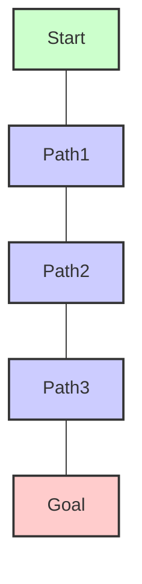

# Chapter 7: Motion Planning and Navigation

## Learning Objectives

-   Learn algorithms for robot navigation and obstacle avoidance.
-   Understand the concept of Configuration Space (C-space).
-   Explore different pathfinding and motion planning algorithms.

## Introduction

For a robot to operate effectively in the real world, it must possess the ability to move from one point to another without colliding with obstacles. This seemingly simple task encapsulates two complex and critical areas of robotics: motion planning and navigation. Motion planning involves finding a sequence of valid configurations for a robot to move from a start state to a goal state, while avoiding collisions with its environment. Navigation, on the other hand, deals with a robot's ability to determine its position and orientation (localization) and to then traverse a path to a target location. This chapter will delve into the core principles and algorithms that empower robots to intelligently plot their course, navigate through complex terrains, and dynamically adapt to changing surroundings. From understanding abstract configuration spaces to implementing sophisticated pathfinding techniques, you will gain insight into how autonomous systems achieve seamless and safe movement in the physical world.

## Configuration Space (C-space)

The concept of Configuration Space, or C-space, is fundamental to motion planning. It provides an abstract representation of all possible positions and orientations that a robot can take. Instead of dealing with the complex geometry of a robot and its environment in the real (work) space, C-space simplifies the problem by representing the robot as a single point. Consequently, obstacles in the work space are "grown" or "expanded" to account for the robot's shape and size, transforming them into C-obstacles in the C-space.

In C-space:
*   **Robot Configuration:** A single point represents the entire robot's state (e.g., joint angles for a manipulator, (x, y, θ) for a mobile robot).
*   **C-Obstacles:** Regions in C-space that correspond to configurations where the robot would collide with an obstacle in the work space.
*   **Free C-space:** The set of all configurations where the robot is collision-free. Motion planning then becomes the task of finding a path for a point (the robot) through the free C-space.

The dimensionality of C-space is equal to the number of the robot's degrees of freedom (DOF). For simple robots, C-space can be visualized (e.g., a 2-DOF arm's C-space is a 2D plane). For complex robots, C-space can be high-dimensional and non-Euclidean, making its explicit construction challenging. Despite this, C-space is a powerful conceptual tool for formalizing motion planning problems and designing algorithms.

## Pathfinding Algorithms (A*, Dijkstra)

Once the motion planning problem is formulated in C-space, the next step is to find a path through the free C-space from a start configuration to a goal configuration. This is where pathfinding algorithms come into play. These algorithms are typically graph-based, searching for the shortest or optimal path in a discrete representation of the C-space.

Two classical and widely used pathfinding algorithms are:

*   **Dijkstra's Algorithm:**
    *   **Description:** A shortest path algorithm that finds the path with the lowest cost (e.g., shortest distance) between a single source node and all other nodes in a graph. It works by iteratively expanding the search from the start node, always visiting the unvisited node with the smallest known distance from the start.
    *   **Application in Robotics:** Useful for finding optimal paths in known, static environments where all edge costs are non-negative. It guarantees finding the shortest path.

*   **A* (A-star) Search Algorithm:**
    *   **Description:** An extension of Dijkstra's algorithm that improves efficiency by using a heuristic function to guide its search. It estimates the cost from the current node to the goal node, prioritizing paths that seem more promising. The heuristic must be admissible (never overestimating the true cost to the goal) for A* to guarantee optimality.
    *   **Application in Robotics:** Very popular for robot pathfinding in grid-based maps or navigation graphs. Its informed search significantly reduces computation compared to Dijkstra's, making it suitable for larger or more complex environments.

Both algorithms require a discretized representation of the environment (a graph or grid). For continuous C-spaces, sampling-based algorithms (discussed later) are often used to construct such a graph.

## Bug Algorithms

Bug algorithms are a class of simple, reactive motion planning strategies primarily used by mobile robots to navigate around obstacles in a 2D environment. They are called "bug" algorithms because they mimic the behavior of a simple insect that follows walls or edges to bypass obstacles. These algorithms are generally local and do not require a global map of the environment, making them suitable for unknown or dynamically changing spaces.

Key characteristics of Bug Algorithms:
*   **No Global Map:** The robot only uses local sensor information (e.g., proximity sensors) to detect obstacles.
*   **Reactive:** The robot reacts to obstacles as it encounters them.
*   **Guaranteed to Reach Goal (if reachable):** Under certain conditions (e.g., simply connected environment, no concave obstacles that trap the robot), these algorithms can guarantee finding a path to the goal.

Two common types of Bug Algorithms are:

1.  **Bug1 Algorithm:**
    *   The robot moves towards the goal.
    *   If an obstacle is encountered, the robot traces the boundary of the obstacle until it finds a point closer to the goal than the point where it initially encountered the obstacle.
    *   It then leaves the obstacle and resumes moving towards the goal.

2.  **Bug2 Algorithm:**
    *   The robot moves towards the goal along a "M-line" (a straight line from the start to the goal).
    *   If an obstacle is encountered, the robot traces the boundary of the obstacle until it re-intersects the M-line at a point closer to the goal than the point where it left the M-line.
    *   It then leaves the obstacle and resumes moving towards the goal along the M-line.

Bug algorithms are simple to implement and computationally inexpensive, making them suitable for resource-constrained robots or initial explorations of unknown environments. However, they may generate suboptimal paths (longer than necessary).

## SLAM (Simultaneous Localization and Mapping)

Simultaneous Localization and Mapping (SLAM) is one of the most fundamental and challenging problems in robotics. It refers to the computational problem of constructing or updating a map of an unknown environment while simultaneously keeping track of an agent's (robot's) location within that environment. This "chicken-and-egg" problem is difficult because an accurate map is needed for accurate localization, and accurate localization is needed to build an accurate map.

SLAM is critical for autonomous mobile robots operating in previously unknown environments, such as:
*   **Autonomous Vehicles:** Building maps of streets and identifying their position.
*   **Exploration Rovers:** Mapping planetary surfaces or underwater environments.
*   **Service Robots:** Navigating within homes or offices.

The core components of a SLAM system typically include:
*   **Sensor Data:** Input from various sensors like LiDAR, cameras, sonar, and IMUs.
*   **Frontend (Odometry/Data Association):** Processes raw sensor data to estimate robot motion and identify correspondences between current sensor readings and previous observations (e.g., feature matching in images).
*   **Backend (Optimization):** Refines the map and robot pose estimates by minimizing errors accumulated over time, often using techniques like graph optimization or Kalman filters.

Various algorithms exist for SLAM, including Extended Kalman Filter (EKF-SLAM), Particle Filter (FastSLAM), and Graph-based SLAM. The choice of algorithm depends on the environment, sensor types, and computational resources available. SLAM enables robots to achieve true autonomy by allowing them to create and navigate their own mental models of the world.

## Summary

This chapter provided a comprehensive overview of Motion Planning and Navigation, essential capabilities for autonomous robots operating in dynamic environments. We introduced the critical concept of Configuration Space (C-space), which simplifies collision detection by representing the robot as a point and obstacles as expanded regions. We then explored various pathfinding algorithms, including classic graph-based approaches like Dijkstra's and A* search, as well as more reactive methods like Bug Algorithms and rapidly-exploring random trees (RRTs). The chapter also touched upon the challenge of Simultaneous Localization and Mapping (SLAM), where robots build a map of an unknown environment while simultaneously tracking their position within it. By understanding these algorithms and concepts, we can equip robots with the intelligence to autonomously navigate complex environments, avoid static and dynamic obstacles, and achieve their goals efficiently and safely, pushing the boundaries of what autonomous systems can accomplish.

## Code Examples

### Example 1: A* (A-star) Pathfinding Algorithm on a Grid

This Python example implements the A* pathfinding algorithm on a 2D grid with obstacles. This is a common method for robots to find an optimal path from a start to a goal position.

```python
# a_star_pathfinding.py
import heapq

class Node:
    def __init__(self, position, parent=None):
        self.position = position
        self.parent = parent
        self.g = 0  # Cost from start to current node
        self.h = 0  # Heuristic cost from current node to end
        self.f = 0  # Total cost (g + h)

    def __eq__(self, other):
        return self.position == other.position

    def __lt__(self, other):
        return self.f < other.f

    def __hash__(self):
        return hash(self.position)

def a_star_search(grid, start, end):
    """
    Finds the shortest path using the A* algorithm.

    Args:
        grid (list of lists): 2D grid representing the environment (0=free, 1=obstacle).
        start (tuple): Start coordinates (row, col).
        end (tuple): End coordinates (row, col).

    Returns:
        list of tuples: Path from start to end, or None if no path found.
    """
    start_node = Node(start)
    end_node = Node(end)

    open_list = []
    closed_list = set()

    heapq.heappush(open_list, start_node)

    while open_list:
        current_node = heapq.heappop(open_list)
        closed_list.add(current_node)

        if current_node == end_node:
            path = []
            current = current_node
            while current is not None:
                path.append(current.position)
                current = current.parent
            return path[::-1] # Return reversed path

        (x, y) = current_node.position
        # Possible movements (8 directions)
        neighbors = [(0, 1), (0, -1), (1, 0), (-1, 0), (1, 1), (1, -1), (-1, 1), (-1, -1)]

        for dx, dy in neighbors:
            neighbor_pos = (x + dx, y + dy)

            # Check if within grid bounds
            if not (0 <= neighbor_pos[0] < len(grid) and 0 <= neighbor_pos[1] < len(grid[0])):
                continue
            # Check if it's an obstacle
            if grid[neighbor_pos[0]][neighbor_pos[1]] == 1:
                continue

            neighbor = Node(neighbor_pos, current_node)

            if neighbor in closed_list:
                continue

            # Calculate costs
            neighbor.g = current_node.g + 1 # Assuming cost of 1 per step
            neighbor.h = abs(neighbor.position[0] - end_node.position[0]) + \
                         abs(neighbor.position[1] - end_node.position[1]) # Manhattan distance heuristic
            neighbor.f = neighbor.g + neighbor.h

            # Check if neighbor is already in open_list with a higher g-cost
            if any(n.position == neighbor.position and n.g <= neighbor.g for n in open_list):
                continue

            heapq.heappush(open_list, neighbor)

    return None # No path found

if __name__ == "__main__":
    # Example Grid (0 = free, 1 = obstacle)
    grid = [
        [0, 0, 0, 0, 1, 0],
        [0, 1, 0, 0, 1, 0],
        [0, 1, 0, 0, 0, 0],
        [0, 0, 0, 1, 1, 0],
        [0, 0, 0, 0, 0, 0]
    ]
    start = (0, 0)
    end = (4, 5)

    path = a_star_search(grid, start, end)

    if path:
        print("Path found:")
        for r, c in path:
            print(f"({r}, {c})")
        
        # Visualize path on grid
        display_grid = [row[:] for row in grid] # Make a copy
        for r, c in path:
            if (r,c) == start:
                display_grid[r][c] = 'S'
            elif (r,c) == end:
                display_grid[r][c] = 'E'
            else:
                display_grid[r][c] = '*'
        
        for row in display_grid:
            print(" ".join(map(str, row)))
    else:
        print("No path found!")

```

### Example 2: Simple Bug1 Algorithm Simulation (Conceptual)

This conceptual Python code outlines the logic for a Bug1 algorithm for a mobile robot. It simulates a robot moving towards a goal and circumnavigating obstacles using local sensor readings.

```python
# bug1_algorithm_conceptual.py

class Robot:
    def __init__(self, start_pos, goal_pos, grid):
        self.pos = list(start_pos)
        self.goal = goal_pos
        self.grid = grid
        self.path = [tuple(self.pos)]
        self.state = "go_to_goal" # or "follow_obstacle"
        self.hit_point = None
        self.min_dist_from_hit_point = float('inf')

    def distance_to_goal(self, current_pos=None):
        if current_pos is None:
            current_pos = self.pos
        return ((self.goal[0] - current_pos[0])**2 + (self.goal[1] - current_pos[1])**2)**0.5

    def sense_obstacle(self):
        # Simulate local sensing (e.g., check adjacent cells)
        x, y = self.pos
        # Check only forward and sides for simplicity
        directions = [(0, 1), (0, -1), (1, 0), (-1, 0)] # N, S, E, W
        
        for dx, dy in directions:
            nx, ny = x + dx, y + dy
            if 0 <= nx < len(self.grid) and 0 <= ny < len(self.grid[0]) and self.grid[nx][ny] == 1:
                return True # Obstacle detected
        return False

    def take_step(self):
        if self.state == "go_to_goal":
            if self.sense_obstacle():
                print(f"Robot at {self.pos}: Obstacle detected. Switching to follow_obstacle.")
                self.state = "follow_obstacle"
                self.hit_point = tuple(self.pos)
                self.min_dist_from_hit_point = self.distance_to_goal()
            else:
                # Move directly towards goal (simplistic, could be improved)
                dx = 1 if self.goal[0] > self.pos[0] else (-1 if self.goal[0] < self.pos[0] else 0)
                dy = 1 if self.goal[1] > self.pos[1] else (-1 if self.goal[1] < self.pos[1] else 0)
                self.pos[0] += dx
                self.pos[1] += dy
                print(f"Robot at {self.pos}: Moving to goal. Current pos: {self.pos}")

        elif self.state == "follow_obstacle":
            # Simulate following obstacle boundary
            # In a real implementation, this would involve more complex wall-following logic
            # For this simple simulation, we'll just move randomly around hit_point for a few steps
            # and then try to go_to_goal if we are closer
            
            # Simple boundary following: try to move right, then up, then left, then down
            possible_moves = [(0, 1), (1, 0), (0, -1), (-1, 0)] # E, S, W, N
            moved = False
            for dx, dy in possible_moves:
                nx, ny = self.pos[0] + dx, self.pos[1] + dy
                if 0 <= nx < len(self.grid) and 0 <= ny < len(self.grid[0]) and self.grid[nx][ny] == 0:
                    self.pos = [nx, ny]
                    moved = True
                    break
            
            current_dist = self.distance_to_goal()
            if current_dist < self.min_dist_from_hit_point:
                self.min_dist_from_hit_point = current_dist
                # If we are closer to goal than any point during this obstacle traversal,
                # consider switching back to go_to_goal
                if current_dist < self.distance_to_goal(self.hit_point) * 0.9: # Heuristic
                    print(f"Robot at {self.pos}: Found point closer to goal. Switching to go_to_goal.")
                    self.state = "go_to_goal"
            
            if not moved: # Stuck or no clear path to move around
                print(f"Robot at {self.pos}: Stuck while following obstacle, attempting to re-evaluate path.")
                self.state = "go_to_goal" # Force re-evaluation

        self.path.append(tuple(self.pos))
        return tuple(self.pos) != self.goal

if __name__ == "__main__":
    grid = [
        [0, 0, 0, 0, 0],
        [0, 1, 1, 1, 0],
        [0, 1, 0, 1, 0],
        [0, 1, 1, 1, 0],
        [0, 0, 0, 0, 0]
    ]
    start = (0, 0)
    goal = (4, 4)

    robot = Robot(start, goal, grid)
    print("Starting Bug1 Simulation...")
    
    max_steps = 50
    steps = 0
    while robot.pos != list(goal) and steps < max_steps:
        robot.take_step()
        steps += 1
    
    if robot.pos == list(goal):
        print(f"\nRobot reached goal in {steps} steps!")
    else:
        print(f"\nRobot did not reach goal within {max_steps} steps.")
    
    print("Path taken:", robot.path)

```

## Diagrams

### Figure 7.1: A* Algorithm Path on a Grid



_This diagram conceptually illustrates a path found by the A* algorithm on a grid, navigating from a start point to a goal point while avoiding obstacles._