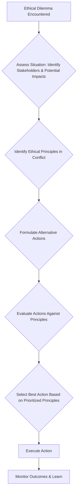

# Chapter 8: The Future and Ethics of AI Robotics

## Learning Objectives

-   Consider the future trajectory of AI robotics.
-   Identify key ethical dilemmas and societal impacts of AI robotics.
-   Understand guidelines for responsible AI development.

## Introduction

As we reach the culmination of our journey through the multifaceted world of AI Robotics, it is imperative to cast our gaze towards the horizon. What does the future hold for intelligent machines, and what profound implications will their advancement have on humanity? This chapter ventures into speculative yet critical territory, exploring emerging trends that promise to redefine the capabilities of robots, from ever-increasing autonomy to more sophisticated human-robot collaboration. More importantly, we will confront the pressing ethical dilemmas posed by these technologies. As robots become more intelligent and integrated into society, questions surrounding safety, bias, privacy, economic disruption, and moral responsibility become increasingly pertinent. This chapter aims to equip you with a framework for critical thinking about these issues, fostering a commitment to responsible innovation and ensuring that the future of AI Robotics serves the greater good.

## Current State-of-the-Art in AI Robotics

The current landscape of AI Robotics is vibrant and rapidly evolving, marked by significant advancements across various domains. Robots are no longer confined to factory floors performing repetitive tasks; they are increasingly intelligent, agile, and capable of operating in unstructured environments.

Key areas of progress include:
*   **Perception:** With advanced computer vision and sensor fusion techniques, robots can now perceive their surroundings with remarkable accuracy, identifying objects, tracking movements, and building detailed 3D maps in real-time. This has enabled breakthroughs in autonomous navigation and object manipulation.
*   **Manipulation:** Robots are gaining unprecedented dexterity, thanks to improved end-effectors, advanced control algorithms, and learning-based approaches. They can handle delicate objects, perform complex assembly tasks, and even assist in surgery with high precision.
*   **Human-Robot Interaction (HRI):** Robots are becoming more intuitive to interact with. Advances in natural language processing allow them to understand verbal commands, while improved social robotics enables them to interpret human emotions and engage in more natural, collaborative tasks.
*   **Locomotion:** From agile humanoid robots capable of walking and running on uneven terrain to drones performing complex aerial maneuvers, robotic locomotion has seen dramatic improvements, expanding the environments in which robots can operate.

These advancements are driven by breakthroughs in deep learning, increased computational power, and access to vast datasets, pushing the boundaries of what AI-powered robots can achieve.

## The Rise of Embodied AI

Embodied AI refers to intelligent agents that possess a physical body and interact with the real world through sensors and actuators. Unlike purely software-based AI, embodied AI faces the unique challenges and opportunities presented by physical constraints, continuous sensory input, and real-time interaction with dynamic environments.

The rise of embodied AI is a critical trend because it grounds artificial intelligence in physical reality, enabling a deeper form of learning and interaction. Robots with embodied intelligence can:
*   **Learn through physical interaction:** Gaining a more intuitive understanding of physics, object properties, and cause-and-effect relationships by physically experimenting with their environment.
*   **Develop common sense:** The challenges of operating in the physical world naturally lead to the acquisition of practical knowledge that is often difficult to program abstractly.
*   **Perform complex real-world tasks:** From household chores to disaster relief, embodied AI promises to bring intelligent automation to a vast array of physical tasks that require adaptability and robust interaction.

Key research areas in embodied AI include robot learning from demonstration, reinforcement learning for motor control, and the development of more versatile and robust robotic hardware. This integration of AI and physical form is essential for creating truly general-purpose robots that can operate autonomously in complex, human-centric environments.

## Ethical Dilemmas (Autonomy, Bias, Job Displacement)

As AI Robotics advances, so too do the ethical questions and societal implications. These technologies hold immense promise but also present significant challenges that demand careful consideration and proactive governance.

### Autonomy and Control:
*   **Who is responsible?** As robots become more autonomous, especially in critical applications like autonomous vehicles or military drones, determining responsibility for errors or harm becomes complex.
*   **Decision-making authority:** Should robots be given the authority to make life-or-death decisions? How do we ensure their decisions align with human values?

### Algorithmic Bias:
*   **Data bias:** AI models learn from data, and if that data reflects existing societal biases (e.g., in facial recognition datasets), robots can perpetuate or even amplify these biases, leading to unfair or discriminatory outcomes.
*   **Fairness and equity:** Ensuring that AI Robotics benefits all segments of society equitably and does not exacerbate existing inequalities.

### Job Displacement and Economic Impact:
*   **Automation's impact on labor:** The increasing automation of tasks by AI-powered robots raises concerns about widespread job displacement across various sectors.
*   **Reskilling and new opportunities:** How can societies prepare their workforces for a future where many traditional jobs are automated, and what new opportunities will emerge?

### Privacy and Surveillance:
*   **Data collection:** Robots equipped with advanced sensors continuously collect vast amounts of data about their surroundings and the people in them, raising significant privacy concerns.
*   **Surveillance capabilities:** The potential for AI robots to be used for surveillance, infringing on personal freedoms and civil liberties.

These dilemmas are not easily resolved and require ongoing dialogue between technologists, ethicists, policymakers, and the public to shape a responsible future for AI Robotics.

## Guidelines for Responsible AI Development

Addressing the ethical dilemmas of AI Robotics requires a concerted effort to establish and adhere to responsible development guidelines. Many organizations and governments worldwide are working to define principles that can steer AI innovation towards positive societal outcomes.

Common themes in responsible AI guidelines include:

*   **Fairness and Non-discrimination:** AI systems should be designed to be fair, avoid bias, and not discriminate against individuals or groups. This requires careful attention to data collection, model training, and evaluation.
*   **Transparency and Explainability:** The decision-making processes of AI systems should be as transparent and understandable as possible. When a robot makes a decision, it should ideally be able to explain why it took that action, especially in critical applications.
*   **Safety and Robustness:** AI robots must be designed to operate safely and reliably, even in unforeseen circumstances. Robustness ensures that systems are resilient to errors, attacks, or unexpected inputs.
*   **Privacy and Security:** Protecting user data and ensuring the security of AI systems against malicious attacks are paramount. This involves implementing robust data governance, encryption, and cybersecurity measures.
*   **Accountability:** Clear lines of responsibility must be established for the design, deployment, and operation of AI systems. There should be mechanisms for redress when AI systems cause harm.
*   **Human Oversight and Control:** While robots gain autonomy, human oversight should be maintained, particularly in high-stakes situations. Humans should have the ability to intervene and override autonomous decisions when necessary.
*   **Beneficial Impact:** AI development should be guided by a commitment to using technology for the good of humanity, promoting well-being, sustainability, and positive societal change.

By embedding these guidelines into the entire lifecycle of AI Robotics development, from research and design to deployment and governance, we can harness the transformative power of intelligent machines while mitigating their potential risks and ensuring a future that benefits everyone.

## Summary

This final chapter ventured into the critical discussions surrounding the future and ethical implications of AI Robotics. We explored the exciting potential of emerging technologies, such as advanced embodied AI and swarm robotics, which promise to push the boundaries of what intelligent machines can achieve. Concurrently, we confronted the significant ethical challenges that accompany these advancements, including concerns about algorithmic bias, job displacement, privacy, and the moral responsibilities associated with developing increasingly autonomous systems. The importance of establishing clear guidelines and fostering a culture of responsible AI development was emphasized as crucial for navigating these complex issues. By engaging with these forward-looking perspectives and ethical considerations, we aim to inspire a thoughtful approach to innovation in AI Robotics, ensuring that technological progress aligns with societal values and contributes positively to our shared future.

## Code Examples

### Example 1: Simple Flocking Simulation (Emergent Behavior)

This Python code demonstrates a very basic flocking simulation, a classic example of emergent behavior where simple rules lead to complex, coordinated group movement. This can represent aspects of swarm robotics.

```python
# simple_flocking_simulation.py
import numpy as np
import matplotlib.pyplot as plt
import matplotlib.animation as animation

# Parameters
NUM_BIRDS = 50
FIELD_SIZE = 100
MAX_SPEED = 2
VISUAL_RANGE = 10

# Initialize random positions and velocities
positions = np.random.rand(NUM_BIRDS, 2) * FIELD_SIZE
velocities = (np.random.rand(NUM_BIRDS, 2) * 2 - 1) * MAX_SPEED

def update_flock(frame):
    global positions, velocities

    # Apply Boids rules (simplistic for demonstration)
    new_velocities = np.copy(velocities)

    for i in range(NUM_BIRDS):
        # Find neighbors within visual range
        distances = np.linalg.norm(positions - positions[i], axis=1)
        neighbors_mask = (distances > 0) & (distances < VISUAL_RANGE)
        neighbors_pos = positions[neighbors_mask]
        neighbors_vel = velocities[neighbors_mask]

        if len(neighbors_pos) > 0:
            # Cohesion: steer towards the average position of local flockmates
            center_of_mass = np.mean(neighbors_pos, axis=0)
            cohesion_vector = (center_of_mass - positions[i]) * 0.01
            new_velocities[i] += cohesion_vector

            # Alignment: steer towards the average heading of local flockmates
            average_velocity = np.mean(neighbors_vel, axis=0)
            alignment_vector = (average_velocity - velocities[i]) * 0.1
            new_velocities[i] += alignment_vector

            # Separation: avoid crowding local flockmates
            separation_vector = np.zeros(2)
            for neighbor_pos in neighbors_pos:
                diff = positions[i] - neighbor_pos
                if np.linalg.norm(diff) < VISUAL_RANGE / 2: # Closer separation
                    separation_vector += diff / np.linalg.norm(diff)**2
            new_velocities[i] += separation_vector * 0.1

    # Update positions and velocities
    velocities = new_velocities
    
    # Limit speed
    speed = np.linalg.norm(velocities, axis=1)
    too_fast_mask = speed > MAX_SPEED
    velocities[too_fast_mask] = velocities[too_fast_mask] / speed[too_fast_mask, np.newaxis] * MAX_SPEED

    positions += velocities

    # Wrap around field edges
    positions %= FIELD_SIZE

    # Update plot
    scatter.set_offsets(positions)
    return scatter,

if __name__ == "__main__":
    fig, ax = plt.subplots()
    scatter = ax.scatter(positions[:, 0], positions[:, 1])
    ax.set_xlim(0, FIELD_SIZE)
    ax.set_ylim(0, FIELD_SIZE)

    ani = animation.FuncAnimation(fig, update_flock, interval=50, blit=True, cache_frame_data=False)
    
    print("Running simple flocking simulation. A plot window should appear.")
    print("Close the plot window to stop the simulation.")
    # plt.show() # Uncomment to display the plot (requires a GUI backend)
```

### Example 2: Conceptual Ethical Decision-Making Framework

This Python code outlines a conceptual framework for ethical decision-making in an AI robot. It uses a simple rule-based approach to weigh different ethical principles when faced with a dilemma.

```python
# ethical_decision_framework.py

def evaluate_decision(scenario, proposed_actions):
    """
    Evaluates proposed actions for a given scenario based on ethical principles.
    This is a conceptual framework, not a real-time decision engine.
    """
    print(f"Scenario: {scenario}")
    ethical_principles = {
        "harm_reduction": {"priority": 5, "description": "Minimize physical or psychological harm."},
        "autonomy_respect": {"priority": 4, "description": "Respect human self-determination."},
        "fairness": {"priority": 3, "description": "Treat all individuals equitably."},
        "beneficence": {"priority": 2, "description": "Act for the benefit of others."},
        "transparency": {"priority": 1, "description": "Ensure actions are understandable and justifiable."}
    }

    print("\nEvaluating Proposed Actions:")
    for action_name, action_details in proposed_actions.items():
        print(f"\nAction: '{action_name}'")
        total_score = 0
        justification = []

        for principle, impact in action_details["ethical_impacts"].items():
            if principle in ethical_principles:
                priority = ethical_principles[principle]["priority"]
                # Impact can be positive (+1), negative (-1), or neutral (0)
                score = priority * impact["value"]
                total_score += score
                justification.append(f"- {principle.replace('_', ' ').capitalize()}: {impact['description']} (Score contribution: {score})")
            else:
                justification.append(f"- Unknown principle: {principle}")

        print("  Justification:")
        for line in justification:
            print(f"    {line}")
        print(f"  Total Ethical Score: {total_score}")

    return "Evaluation complete. Further human review recommended for critical decisions."


if __name__ == "__main__":
    scenario1 = "A delivery robot encounters an accident blocking its path. It can either detour, causing a significant delay for a medical delivery, or attempt to move debris, risking damage to itself and potentially causing minor harm to a bystander."
    actions1 = {
        "Detour": {
            "ethical_impacts": {
                "harm_reduction": {"value": 0, "description": "No direct harm caused."},
                "autonomy_respect": {"value": 0, "description": "Does not impact autonomy."},
                "fairness": {"value": 0, "description": "No direct fairness impact."},
                "beneficence": {"value": -1, "description": "Delays critical medical delivery."},
                "transparency": {"value": 0, "description": "Action is clear."}
            }
        },
        "Move Debris": {
            "ethical_impacts": {
                "harm_reduction": {"value": -1, "description": "Minor risk of harm to bystander, potential damage to robot."},
                "autonomy_respect": {"value": 0, "description": "Does not impact autonomy."},
                "fairness": {"value": 0, "description": "No direct fairness impact."},
                "beneficence": {"value": 1, "description": "Ensures timely medical delivery."},
                "transparency": {"value": 0, "description": "Action is clear."}
            }
        }
    }

    print(evaluate_decision(scenario1, actions1))
    print("\n" + "="*50 + "\n")

    scenario2 = "A home assistance robot detects a gas leak. It can either alert emergency services immediately or first try to confirm with the homeowner who is elderly and might panic."
    actions2 = {
        "Alert Emergency Services Immediately": {
            "ethical_impacts": {
                "harm_reduction": {"value": 1, "description": "Minimizes risk from gas leak."},
                "autonomy_respect": {"value": -1, "description": "Does not respect homeowner's immediate autonomy to confirm."},
                "fairness": {"value": 0, "description": "No direct fairness impact."},
                "beneficence": {"value": 1, "description": "Acts for homeowner's safety."},
                "transparency": {"value": 0, "description": "Action is clear."}
            }
        },
        "Confirm with Homeowner First": {
            "ethical_impacts": {
                "harm_reduction": {"value": -1, "description": "Increases risk from gas leak by delaying alert."},
                "autonomy_respect": {"value": 1, "description": "Respects homeowner's autonomy to confirm."},
                "fairness": {"value": 0, "description": "No direct fairness impact."},
                "beneficence": {"value": 0, "description": "Potential to cause panic, but also avoid false alarm."},
                "transparency": {"value": 0, "description": "Action is clear."}
            }
        }
    }
    print(evaluate_decision(scenario2, actions2))
```

## Diagrams

### Figure 8.1: Simplified Ethical Decision Tree for AI Robotics



_This diagram illustrates a simplified decision tree representing a conceptual framework for AI robots to approach ethical dilemmas, from identifying principles to executing and learning from actions._